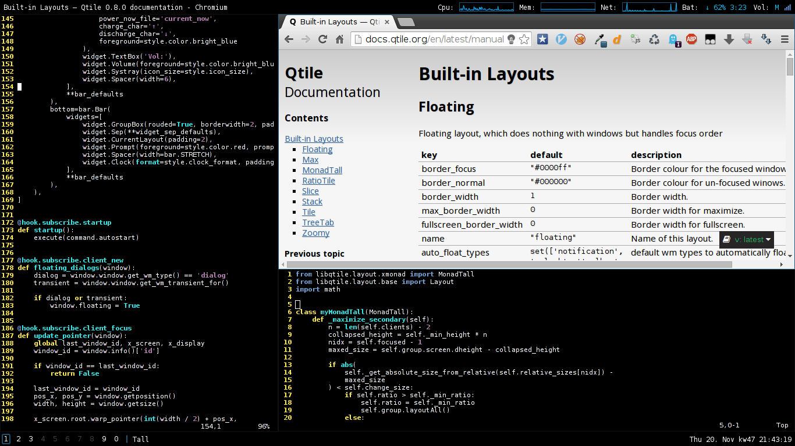

# Config for [Qtile](http://www.qtile.org/)
Qtile is a very nice, hackable tiling window manager written and configured in Python.

Config is tested on Qtile 0.8.0.



## Custom Features
### Update cursor
If You focuse a new window Qtile place the cursor in the middle of it.

### Full maximize
If You maximize an secondary pane it expands to its full available size
in vertical and horizontal.

### VerticalTall (experimental)
Custom layout based on MonadTall. Its basicly an MonadTall without main pane.
Works nice on vertical monitors.

### Debug
If You have some experimental changes and You are not shure if it works You want to
see what is Qtile printing and what Tracebacks it raises.

'debug' is a shell-script that starts Qtile in another x-server (as user).

To make this work You have to set `allowed_users=anybody` in `/etc/X11/Xwrapper.config`.

## Keybindings
### Window manager controls
| Keys                      | Action                    |
| ------------------------- | ------------------------- |
| ALT + CTRL + r            | restart Qtile             |
| ALT + CTRL + q            | shutdown Qtile            |
| ALT + q                   | kill window               |
| ALT + p                   | spawn program             |
| ALT + RETURN              | spawn terminal            |
| ALT + t                   | toggle floating           |
| ALT + SPACE               | next layout               |
| ALT + SHIFT + SPACE       | layout-flip               |

### Move Focus
| Keys                      | Action                    |
| ------------------------- | ------------------------- |
| ALT + $(0..9)             | jump to workspace         |
| ALT + TAB                 | next window               |
| ALT + SHIFT + TAB         | previous window           |
| ALT + h                   | left                      |
| ALT + j                   | down                      |
| ALT + k                   | up                        |
| ALT + l                   | right                     |
| WIN + 1                   | jump to screen 0          |
| WIN + 2                   | jump to screen 1          |
| WIN + 3                   | jump to screen 2          |

### Move Window
| Keys                      | Action                    |
| ------------------------- | ------------------------- |
| ALT + SHIFT + $(0..9)     | move window to workspace  |
| ALT + SHIFT + j           | move window down          |
| ALT + SHIFT + k           | move window up            |
| ALT + i                   | move window to main pane  |

### Alter Window
| Keys                      | Action                    |
| ------------------------- | ------------------------- |
| ALT + SHIFT + h           | shrink/grow window left   |
| ALT + SHIFT + l           | shrink/grow window right  |
| ALT + m                   | maximaize window          |
| ALT + n                   | normalize windows         |
| ALT + SHIFT + n           | reset layout              |

### Lock and Powermangament
| Keys                      | Action                    |
| ------------------------- | ------------------------- |
| ALT + CTRL + l            | lock screen               |
| ALT + CTRL + p            | suspend                   |
| ALT + CTRL + h            | hibernate                 |

## Requirements
```
python-xlib
xscreensaver (optional)
nm-applet (optional)
```

## Install
At first follow the official [Qtile-Installguide](http://docs.qtile.org/en/latest/manual/install/source.html).
Then install the config:
```
$ git clone https://github.com/fscherf/qtile-config.git
$ mv qtile-config ~/.config/qtile
$ sudo cp ~/.config/qtile/conf/qtile.desktop /usr/share/xsessions
```
